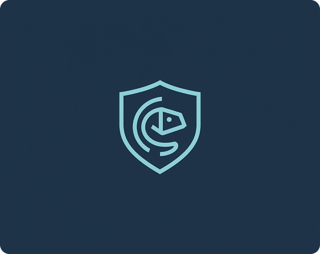
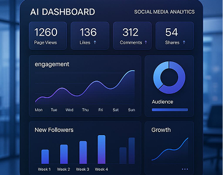
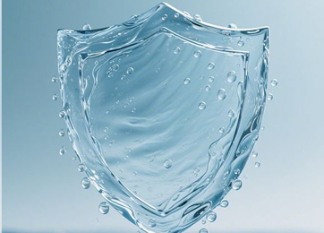
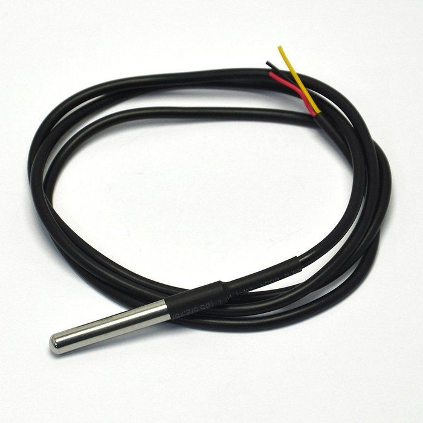
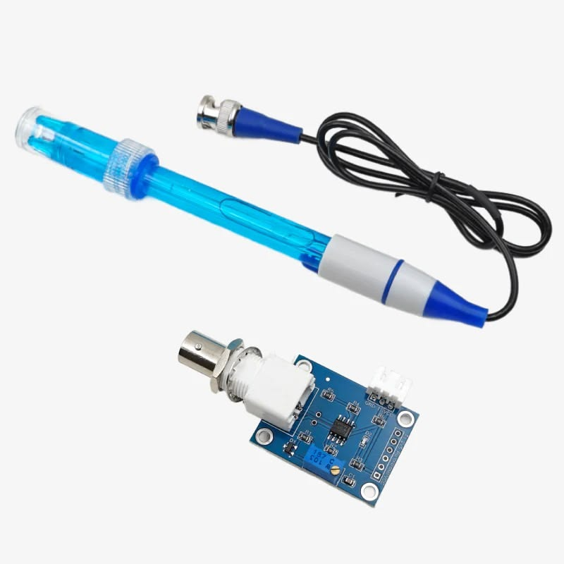
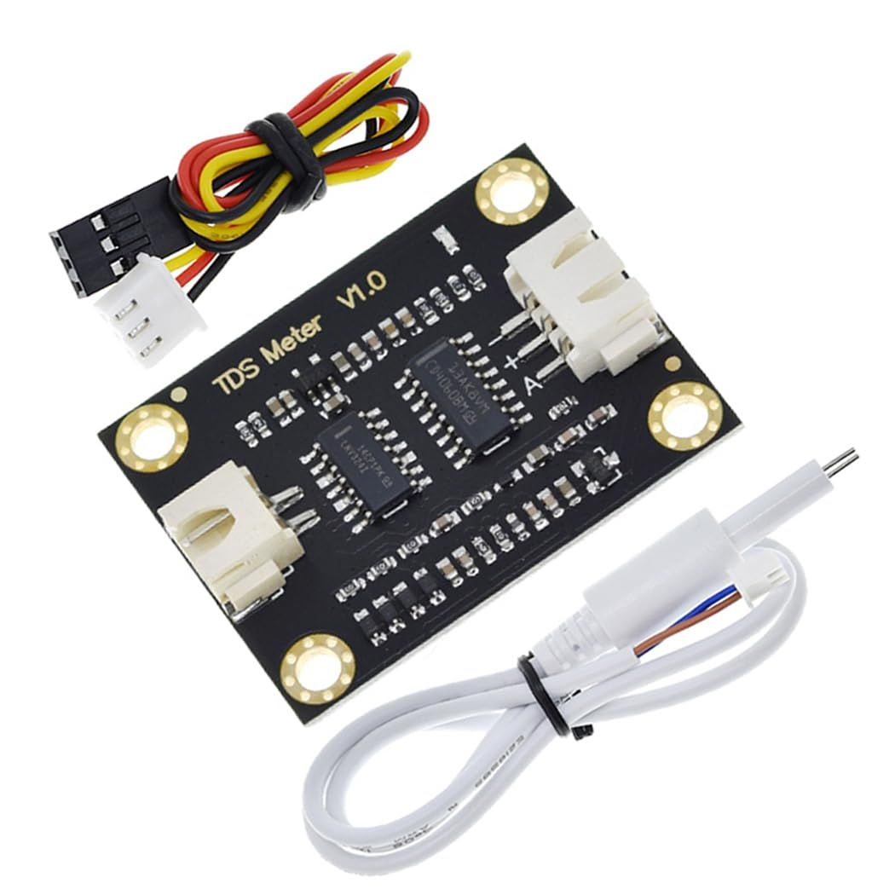
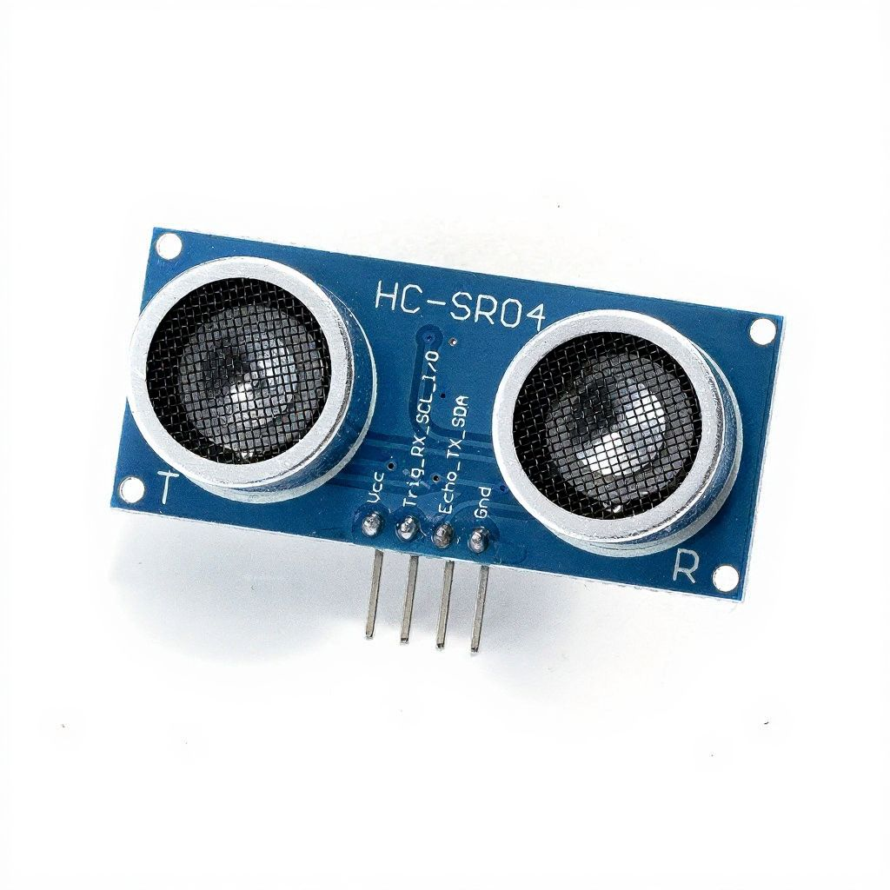

<!-- ── STICKY TOP BAR NAV ─────────────────────────────── -->
<nav class="g-navbar">
  

    
🛡️

    GUARD
  

  <ul class="g-nav-links">
    <li><a href="#overview">Overview</a></li>
    <li><a href="#features">Capabilities</a></li>
    <li><a href="#gallery">Gallery & Reels</a></li>
    <li><a href="#architecture">Architecture</a></li>
    <li><a href="#pipeline">Pipeline</a></li>
    <li><a href="#pragmatics">Stack & BOM</a></li>
    <li><a href="#team">Team</a></li>
  </ul>
  <a href="https://github.com/cepdnaclk/e21-3yp-GUARD" target="_blank" class="g-nav-btn">GitHub Repo ↗</a>
</nav>

  <!-- ── HERO SECTION ─────────────────────────────── -->
  <section class="g-hero" id="overview">
    

    

      

        

          
          Modular IoT Platform
        

        <h1 class="g-hero-title">GUARD: Modular IoT Aquarium & Water Quality System</h1>
        
        <ul class="g-tagline-bullets">
          <li>⚡ Real-Time Multi-Parameter Telemetry Acquisition</li>
          <li>🤖 Autonomous Hysteresis-Driven Actuator Control</li>
          <li>🛡️ Multi-Tier Fail-Safe Cutoffs & Alert Engine</li>
        </ul>

        

          GUARD is an industrial-grade, modular IoT framework engineered for continuous water quality monitoring and dynamic aquatic ecosystem management. Powered by ESP32 microcontrollers, high-throughput MQTT streaming, and a hybrid database persistence engine, GUARD delivers real-time telemetry, automated feeding and pumping, and instant multi-channel alert notifications.
        

        

          <a href="https://github.com/cepdnaclk/e21-3yp-GUARD" target="_blank" class="g-btn-primary">View GitHub Repository ↗</a>
          <a href="#architecture" class="g-btn-secondary">Explore Architecture ↓</a>
        

      

      

        

          <h3 style="margin-top:0; font-size:1.15rem; color:#fff;">Live Telemetry Monitor</h3>
          

            Water Temperature
            26.5 °C
          

          

            pH Level
            7.4 pH
          

          

            Total Dissolved Solids
            340 ppm
          

          

            Water Depth Level
            85.0 %
          

          

            Actuator Status
            ACTIVE (PUMP ON)
          

          

            System Health
            NOMINAL 🟢
          

        

      

    

  </section>

  <!-- ── VALUE PROPOSITION (3x2 GRID) ─────────────────────────────── -->
  <section id="features">
    

      <h2 class="g-section-title">Core Engineering Capabilities</h2>
      
Engineered to eliminate manual monitoring friction and protect aquatic ecosystems round-the-clock.

    

    

      

        
🛰️

        <h3 class="g-val-title">Multi-Sensor Telemetry Stream</h3>
        
Continuous high-frequency acquisition of Temperature (DS18B20), pH, TDS, Turbidity, and Ultrasonic Water Level measurements with hardware-level noise filtering.

      

      

        
⚙️

        <h3 class="g-val-title">Autonomous Control Engine</h3>
        
Deadband hysteresis control loops prevent relay chattering while automatically switching heaters, water pumps, air pumps, and servo feeders based on target thresholds.

      

      

        
💾

        <h3 class="g-val-title">Dual-Layer Database Engine</h3>
        
Combines MongoDB via Prisma for rapid application state & device mapping with InfluxDB time-series storage for long-term telemetry analytics.

      

      

        
🚨

        <h3 class="g-val-title">Multi-Channel Alert Dispatch</h3>
        
Real-time push notifications via WebSockets (Socket.IO), automated email dispatch, and instant Telegram Bot alerts with configurable spam suppression windows.

      

      

        
📱

        <h3 class="g-val-title">Cross-Platform Control Clients</h3>
        
Sleek React 18 Tailwind web dashboard combined with an Expo React Native mobile app supporting live charts, interactive controls, and role-based access.

      

      

        
🔒

        <h3 class="g-val-title">Fail-Safe Emergency Cutoffs</h3>
        
Automatic hardware cutoffs trigger immediate fail-safe state during probe disconnections, out-of-bounds readings, or power loss recovery.

      

    

  </section>

  <!-- ── VISUAL & MOTION VIDEO SHOWCASE ─────────────────────────────── -->
  <section id="gallery">
    

      <h2 class="g-section-title">Visual Gallery & Motion Demonstrations</h2>
      
Explore physical hardware assembly, CAD renders, and motion video reels of the operational system.

    

    <!-- Motion Video Reel Section -->
    

      <h3 style="margin-top:0; color:#fff; font-size:1.3rem; margin-bottom:16px;">🎥 Live System Operational Demonstration</h3>
      

        <video controls autoplay loop muted poster="images/dashboard.png">
          <source src="images/Device_intro.mp4" type="video/mp4">
          Your browser does not support HTML5 video playback.
        </video>
      

      

        Video: Real-time telemetry ingestion, relay actuation response, and mobile dashboard synchronization.
      

    

    <!-- Concept Renders Grid -->
    <h3 style="color:#ffffff; font-size:1.3rem; margin-bottom:20px;">System CAD & Concept Renders</h3>
    

      

        
        

          
Modular Enclosure Overview

          
Waterproof IP65 Central Control Unit setup

        

      

      

        
        

          
Sensor Probe Mounting

          
Isolated probe array placement for accuracy

        

      

      

        
        

          
Actuator Relay Subsystem

          
Optocoupled relay isolation for AC pumps & heaters

        

      

      

        
        

          
Automated Feeder Mechanism

          
Servo-driven dispense mechanism

        

      

    

    <!-- Physical Hardware Photos Grid -->
    <h3 style="color:#ffffff; font-size:1.3rem; margin-bottom:20px;">Physical Hardware & Sensor Array</h3>
    

      

        
        

          
DS18B20 Temperature Sensor

          
Submersible stainless steel thermal probe

        

      

      

        
        

          
Gravity pH Sensor Probe

          
Precision analog pH signal conditioner

        

      

      

        
        

          
TDS / EC Sensor Probe

          
Water purity & electrical conductivity sensing

        

      

      

        
        

          
Ultrasonic Water Level Probe

          
Non-contact tank height measurement

        

      

    

  </section>

  <!-- ── SYSTEM ARCHITECTURE ─────────────────────────────── -->
  <section id="architecture">
    

      <h2 class="g-section-title">System Architecture</h2>
      
Distributed end-to-end IoT flow connecting hardware edge nodes, MQTT broker services, and cloud storage.

    

    

      

        

          
🔌 ESP32 Edge Node

          
Sensors $\rightarrow$ ADC $\rightarrow$ Hysteresis Control

        

        
➔

        

          
📡 MQTT Broker

          
TLS Encrypted Telemetry & Command Topics

        

        
➔

        

          
⚡ Express Backend

          
Ingestion $\rightarrow$ Rules Engine $\rightarrow$ Alert Dispatcher

        

        
➔

        

          
💾 InfluxDB + Mongo

          
Time-series history & MongoDB application state

        

        
➔

        

          
💻 Web & Mobile App

          
Socket.IO Live Charts & Remote Control

        

      

      

        <h4 style="margin-top:0; color:var(--g-sky-light);">Architectural Blueprint Overview</h4>
        

          The system operates on an event-driven architecture. The ESP32 edge microcontroller reads analog/digital sensor signals, performs local calibration and noise filtering, and streams JSON telemetry payloads over MQTT topics. The Node.js/Express backend consumes these topics, updates device state in MongoDB via Prisma, logs historical records in InfluxDB, and broadcasts live telemetry packets over WebSockets to connected Web and Mobile clients.
        

      

    

  </section>

  <!-- ── OPERATIONAL PIPELINE ─────────────────────────────── -->
  <section id="pipeline">
    

      <h2 class="g-section-title">Operational Data Pipeline</h2>
      
Step-by-step sequence of how telemetry moves from physical probes to actionable user insights.

    

    

      

        
1

        

          
Sensor Acquisition & Analog Calibration

          
Probes sample physical water metrics (Temperature, pH, TDS, Depth). ESP32 ADC converts raw signals using linear calibration curves.

        

      

      

        
2

        

          
Edge Filtering & Hysteresis Processing

          
Moving average digital filters eliminate transient electrical noise. Hysteresis bounds prevent rapid relay toggling.

        

      

      

        
3

        

          
Safe Threshold Evaluation

          
Readings are continuously validated against user-defined upper/lower bounds stored in non-volatile flash memory.

        

      

      

        
4

        

          
Actuator Control & Relay Switching

          
If metrics breach target thresholds, the control loop triggers relays to activate heaters, water pumps, or automated feeders.

        

      

      

        
5

        

          
Telemetry Ingestion & Hybrid Persistence

          
Data packets stream to MQTT topics. The backend writes active tank status to MongoDB and time-series history to InfluxDB.

        

      

      

        
6

        

          
Real-Time UI Push & Multi-Channel Alerts

          
Live WebSocket streams update React charts immediately. If critical breaches persist, instant Email and Telegram alerts dispatch to operators.

        

      

    

  </section>

  <!-- ── PRAGMATICS: TECH STACK & BILL OF MATERIALS ─────────────────────────────── -->
  <section id="pragmatics">
    

      <h2 class="g-section-title">Pragmatics & Bill of Materials</h2>
      
Comprehensive technical implementation stack and transparent hardware cost distribution.

    

    <!-- Tech Stack Matrix -->
    

      

        
Frontend Layer

        <ul class="g-stack-items">
          <li>React 18 & Vite</li>
          <li>Tailwind CSS & Glassmorphism</li>
          <li>Recharts & ECharts</li>
          <li>Socket.IO Client</li>
        </ul>
      

      

        
Backend Service

        <ul class="g-stack-items">
          <li>Node.js & Express</li>
          <li>Prisma ORM & MongoDB</li>
          <li>InfluxDB Time-Series</li>
          <li>MQTT Ingestion Engine</li>
        </ul>
      

      

        
Embedded Firmware

        <ul class="g-stack-items">
          <li>C++ / Arduino Framework</li>
          <li>ESP32 Dual-Core CPU</li>
          <li>PubSubClient MQTT</li>
          <li>Preferences Flash Storage</li>
        </ul>
      

      

        
Mobile & Alerts

        <ul class="g-stack-items">
          <li>Expo React Native</li>
          <li>Telegram Bot API</li>
          <li>Nodemailer Service</li>
          <li>JWT & Role Security</li>
        </ul>
      

    

    <!-- Rigid Bordered BOM Table -->
    <h3 style="color:#ffffff; font-size:1.3rem; margin-bottom:16px;">Hardware Bill of Materials (BOM)</h3>
    

      <table class="g-bom-table">
        <thead>
          <tr>
            <th>#</th>
            <th>Component Item</th>
            <th>Specification / Details</th>
            <th>Qty</th>
            <th>Unit Cost (LKR)</th>
            <th>Total (LKR)</th>
          </tr>
        </thead>
        <tbody>
          <tr>
            <td>1</td>
            <td>ESP32 Development Board</td>
            <td>Dual-core 240MHz, Wi-Fi/BLE microcontroller</td>
            <td>1</td>
            <td>4,000</td>
            <td>4,000</td>
          </tr>
          <tr>
            <td>2</td>
            <td>DS18B20 Temperature Sensor</td>
            <td>Waterproof stainless steel thermal probe</td>
            <td>1</td>
            <td>800</td>
            <td>800</td>
          </tr>
          <tr>
            <td>3</td>
            <td>Gravity pH Sensor Module</td>
            <td>DFRobot / pH-4502C analog conditioner probe</td>
            <td>1</td>
            <td>5,000</td>
            <td>5,000</td>
          </tr>
          <tr>
            <td>4</td>
            <td>ORP Sensor Module</td>
            <td>Oxidation-Reduction Potential probe</td>
            <td>1</td>
            <td>6,000</td>
            <td>6,000</td>
          </tr>
          <tr>
            <td>5</td>
            <td>EC Electrical Conductivity Sensor</td>
            <td>Water salinity / EC measurement module</td>
            <td>1</td>
            <td>6,500</td>
            <td>6,500</td>
          </tr>
          <tr>
            <td>6</td>
            <td>TDS Sensor Module</td>
            <td>Total Dissolved Solids analog probe</td>
            <td>1</td>
            <td>2,500</td>
            <td>2,500</td>
          </tr>
          <tr>
            <td>7</td>
            <td>Ultrasonic / Float Level Switch</td>
            <td>Water level detection sensor</td>
            <td>1</td>
            <td>600</td>
            <td>600</td>
          </tr>
          <tr>
            <td>8</td>
            <td>Optocoupled Relay Module</td>
            <td>4-Channel 5V relay board for AC appliances</td>
            <td>1</td>
            <td>1,200</td>
            <td>1,200</td>
          </tr>
          <tr>
            <td>9</td>
            <td>Power Supply & Regulators</td>
            <td>12V DC Adapter, LM2596 Buck Converter</td>
            <td>1</td>
            <td>3,000</td>
            <td>3,000</td>
          </tr>
          <tr>
            <td>10</td>
            <td>Enclosure & Wiring Accessories</td>
            <td>Waterproof IP65 junction box, terminal blocks</td>
            <td>-</td>
            <td>2,000</td>
            <td>2,000</td>
          </tr>
          <tr class="g-total-row">
            <td colspan="5" style="text-align:right;">ESTIMATED TOTAL HARDWARE COST:</td>
            <td>34,600 LKR</td>
          </tr>
        </tbody>
      </table>
    

  </section>

  <!-- ── METADATA & FOOTER ─────────────────────────────── -->
  <footer class="g-footer" id="team">
    

      

        

          
🛡️ GUARD System

          

            Modular IoT Aquarium & Water Quality Management System. 
            Developed at the Department of Computer Engineering, Faculty of Engineering, University of Peradeniya.
          

        

        

          
Engineering Team

          <ul class="g-footer-links">
            <li>• Ravindu Ashan (<a href="mailto:e21039@eng.pdn.ac.lk">e21039@eng.pdn.ac.lk</a>)</li>
            <li>• Shashika Sathsarani (<a href="mailto:e21362@eng.pdn.ac.lk">e21362@eng.pdn.ac.lk</a>)</li>
            <li>• Thisen Lakdinu (<a href="mailto:e21231@eng.pdn.ac.lk">e21231@eng.pdn.ac.lk</a>)</li>
          </ul>
        

        

          
Quick Resources

          <ul class="g-footer-links">
            <li><a href="https://github.com/cepdnaclk/e21-3yp-GUARD" target="_blank">GitHub Code Repository ↗</a></li>
            <li><a href="http://www.ce.pdn.ac.lk/" target="_blank">Department of Computer Engineering ↗</a></li>
            <li><a href="https://eng.pdn.ac.lk/" target="_blank">Faculty of Engineering, Peradeniya ↗</a></li>
          </ul>
        

      

      

        © 2026 e21-3yp-GUARD Team. Released under the MIT License. | <a href="#top" style="color:var(--g-sky-light);">Back to Top ↑</a>
      

    

  </footer>

